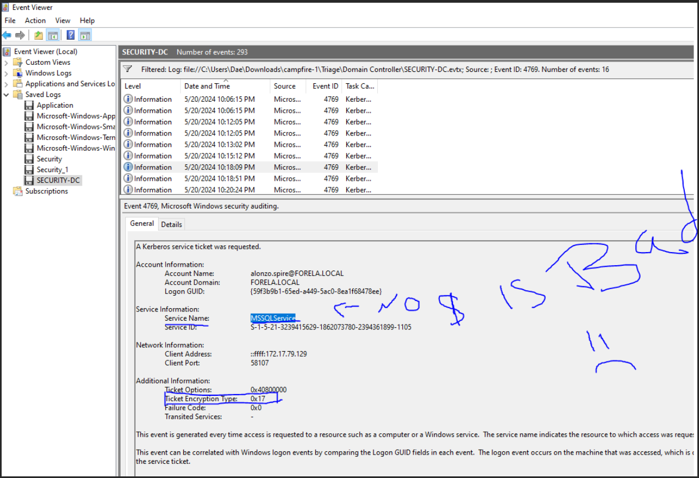
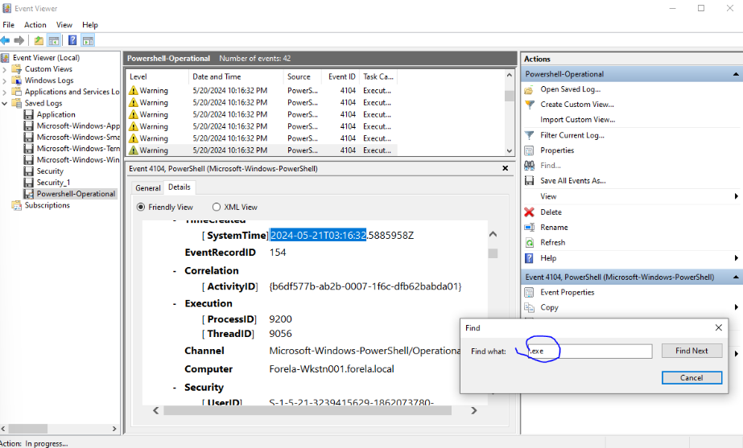

www.linkedin.com/in/daemon-adams

# Portfolio
Welcome to my professional cybersecurity portfolio. Below, you will find a collection of my work, displaying home labs, HTB Sherlocks, SIEM tools, DFIR tools, and more, demonstrating my hands-on experience in the field. I am currently seeking a position where I can leverage my Blue Team skills and contribute to the evolving landscape of cybersecurity. Eager to join a forward-thinking organization, I look forward to applying my knowledge in threat detection, incident response, and security monitoring to help strengthen cybersecurity defenses.

# Projects


# HTB Sherlocks 

HTB Sherlocks is a Capture The Flag (CTF) challenge designed for Blue Teamers. It presents real-world security scenarios and provides related files for analysis. As security analysts, our task is to investigate these cases—whether by performing Digital Forensics and Incident Response (DFIR) to uncover missing files or analyzing Splunk alerts for potential threats.

Below, you'll find my progress and solutions for the Sherlock Labs.

## Campfire -  (DFIR Sherlock)
Date Investigated: 03/20/2025

Tools Used: Event Viewer, Timeline Explorer

### Scenario 
Alonzo Spotted Weird files on his computer and informed the newly assembled SOC Team. Assessing the situation it is believed a Kerberoasting attack may have occurred in the network. It is your job to confirm the findings by analyzing the provided evidence. You are provided with: 1- Security Logs from the Domain Controller 2- PowerShell-Operational Logs from the affected workstation 3- Prefetch Files from the affected workstation

Task 1: Analyzing Domain Controller Security Logs, can you confirm the date & time when the kerberoasting activity occurred?

Answer: 2024-05-21 03:18:09
### Explanation
To find kerberoasting activity, I started off by searching for Event ID 4768. Event ID 4768 is logged on the Domain Controllers (DC), and tracks failed or successful instances of kerberoasting. Shown below you will see I found a account with a different service name from the standard "DC$", as well as the Ticket Encryption Type being 0x17.


Task 2: What is the Service Name that was targeted?

Answer: MSSQLService
### Explanation
In the image shown above we can find the service name that was targeted. You will start to see a trend of most of the questions being on the same image in some cases.

Task 3:It is really important to identify the Workstation from which this activity occurred. What is the IP Address of the workstation?

Answer: 172.17.79.129
### Explanation
In the same image above you can also find the IP Address of the compromised workstation. So at this point we have the IP address of the workstation, the Service Name, and the time this event took place.

Task 4: Now that we have identified the workstation, a triage including PowerShell logs and Prefetch files are provided to you for some deeper insights so we can understand how this activity occurred on the endpoint. What is the name of the file used to Enumerate Active directory objects and possibly find Kerberoastable accounts in the network?

Answer: powerview.ps1
### Explanation
PowerView.ps1 is a well-known PowerShell script from the PowerSploit framework, commonly used for Active Directory (AD) enumeration. Searching for Event ID 4104 (PowerShell Script Block Logging) will be my first step in finding the answer, this detects PowerView execution, shown below.


Task 5:When was this script executed?

Answer:2024-05-21T03:16:32
### Explanation
When reading the question I knew to click Find -> search for ".exe" and it pointed me to the event with the script being executed and i simply copied the date in the event details.


Task 6: What is the full path of the tool used to perform the actual kerberoasting attack?

Answer: C:\Users\Alonzo.spire\Downloads\Rubeus.exe
### Explanation
I used PECmd to convert the prefetch files into a .csv format for TimeLine Explorer to open. Doing so will allow me to use the date provided from Event Viewer screenshotted above → Type the date into the search box on the top right in Timeline Explorer → leads us to the file path.

Task 7: When was the tool executed to dump credentials?

Answer: 2024-05-21 03:18:08
### Explanation
Can be found when looking for the file path in TimelineExplorer.

## Header 2

> This is a blockquote following a header.
>
> When something is important enough, you do it even if the odds are not in your favor.

### Header 3

```js
// Javascript code with syntax highlighting.
var fun = function lang(l) {
  dateformat.i18n = require('./lang/' + l)
  return true;
}
```

```ruby
# Ruby code with syntax highlighting
GitHubPages::Dependencies.gems.each do |gem, version|
  s.add_dependency(gem, "= #{version}")
end
```

#### Header 4

*   This is an unordered list following a header.
*   This is an unordered list following a header.
*   This is an unordered list following a header.

##### Header 5

1.  This is an ordered list following a header.
2.  This is an ordered list following a header.
3.  This is an ordered list following a header.

###### Header 6

| head1        | head two          | three |
|:-------------|:------------------|:------|
| ok           | good swedish fish | nice  |
| out of stock | good and plenty   | nice  |
| ok           | good `oreos`      | hmm   |
| ok           | good `zoute` drop | yumm  |

### There's a horizontal rule below this.

* * *

### Here is an unordered list:

*   Item foo
*   Item bar
*   Item baz
*   Item zip

### And an ordered list:

1.  Item one
1.  Item two
1.  Item three
1.  Item four

### And a nested list:

- level 1 item
  - level 2 item
  - level 2 item
    - level 3 item
    - level 3 item
- level 1 item
  - level 2 item
  - level 2 item
  - level 2 item
- level 1 item
  - level 2 item
  - level 2 item
- level 1 item

### Small image


### Large image


### Definition lists can be used with HTML syntax.

<dl>
<dt>Name</dt>
<dd>Godzilla</dd>
<dt>Born</dt>
<dd>1952</dd>
<dt>Birthplace</dt>
<dd>Japan</dd>
<dt>Color</dt>
<dd>Green</dd>
</dl>

```
Long, single-line code blocks should not wrap. They should horizontally scroll if they are too long. This line should be long enough to demonstrate this.
```

```
The final element.
```
