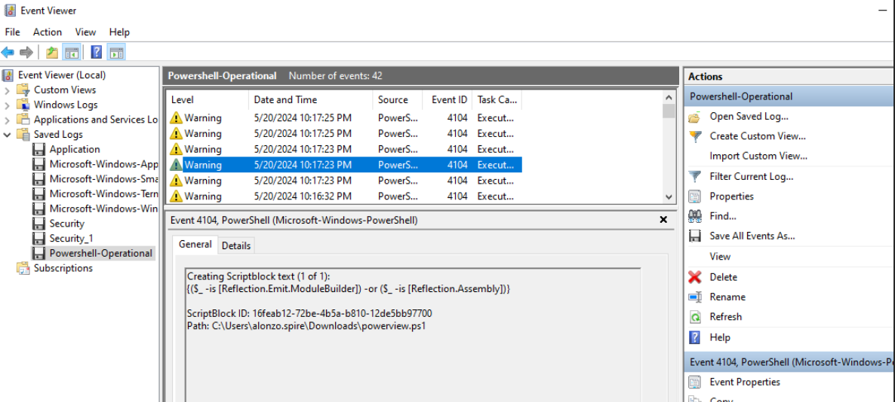

www.linkedin.com/in/daemon-adams

# Portfolio
Welcome to my professional cybersecurity portfolio. Below, you will find a collection of my work, displaying home labs, HTB Sherlocks, SIEM tools, DFIR tools, and more, demonstrating my hands-on experience in the field. I am currently seeking a position where I can leverage my Blue Team skills and contribute to the evolving landscape of cybersecurity. Eager to join a forward-thinking organization, I look forward to applying my knowledge in threat detection, incident response, and security monitoring to help strengthen cybersecurity defenses.

# Projects
## **Azure Honeypot Detection Lab (Microsoft Sentinel)**


**Tools & Stack:**
  Azure Virtual Machine (Windows 10 Pro)
  Microsoft Sentinel (SIEM)
  Log Analytics Workspace
  Windows Event Logs (Event ID 4625)
  KQL (Kusto Query Language)
  GeoIP Enrichment + Attack Heatmap
  

### Professional Statement

I'm building real-world defensive security skills, cloud logging, threat detection, and incident response. This home lab showcases my ability to configure and analyze in Azure environments using Sentinel and KQL to visualize attacker data.

---
## Project Overview

| Phase             | What I Did |
|-------------------|------------|
| **Deployment**    | Deployed a public Windows VM honeypot, deliberately exposing it to brute-force attempts by disabling default firewall rules and inviting attacker activity |
| **Data Collection** | Captured failed login attempts (Event ID 4625), shipped logs to Sentinel via Azure Monitor Agent |
| **Threat Correlation** | Built a GeoIP watchlist CSV and used KQL to enrich log data with attacker IP, city, country, and geo‑coordinates |
| **Visualization**  | Created an attack map workbook in Sentinel to display geolocated threat sources in near-real time |
| **Outcomes**       | Detected unauthorized login attempts from global regions (ex: Russia), practiced detection engineering, SIEM configuration, and incident workflow |


## Skills & Learnings
- Azure cloud architecture and honeypot setup  
- Microsoft Sentinel configuration and log forwarding  
- Advanced KQL queries: conditional filters, geo enrichment, projection, summaries  
- Threat detection and attribution via failed login correlation  
- Mapping attacker patterns to real IP geography  
- Incident reporting: identifying IOCs, providing mitigation, outlining proactive measures


## Visualization Output
Here’s a sample of the attack map generated in Sentinel using enriched GeoIP telemetry:


## Real-time Visual
This is a prime example of a attacker named "marco" trying to access my workstation. He or she is seen trying to log in to my vm. When i look up their IP Address. I get the location of *Russia, Saint-Petersburg*.


## KQL query
To view the data we can go back to our Logs table we can query for specific geo locations. using the provided query:

```kql
let GeoIPDB_FULL = _GetWatchlist("geoip");
let WindowsEvents = SecurityEvent
    | where IpAddress == "xx.xx.xx.xx"
    | where EventID == 4625
    | order by TimeGenerated desc
    | evaluate ipv4_lookup(GeoIPDB_FULL, IpAddress, network);
WindowsEvents
| project TimeGenerated, Computer, AttackerIp = IpAddress, cityname, countryname, longitude, latitude
```
This query extracts failed login attempts tied to a User conor external IP address *the attacker who tried to login*. This query correlates these events with a GeoIP watchlist, and outputs relevant metadata such as host machine, timestamp, and geolocation of the attack source.


The picture below is a KQL query that i imported to help specify the countryname, cityname, statename and etc. of each corresponding IP address


---

# HTB Sherlocks 

HTB Sherlocks is a Capture The Flag (CTF) challenge designed for Blue Teamers. It presents real-world security scenarios and provides related files for analysis. As security analysts, our task is to investigate these cases—whether by performing Digital Forensics and Incident Response (DFIR) to uncover missing files or analyzing Splunk alerts for potential threats.

Below, you'll find my progress and solutions for the Sherlock Labs.

## Campfire -  (DFIR Sherlock)
Date Investigated: 03/20/2025

Tools Used: Event Viewer, Timeline Explorer

### Scenario 
Alonzo Spotted Weird files on his computer and informed the newly assembled SOC Team. Assessing the situation it is believed a Kerberoasting attack may have occurred in the network. It is your job to confirm the findings by analyzing the provided evidence. You are provided with: 1- Security Logs from the Domain Controller 2- PowerShell-Operational Logs from the affected workstation 3- Prefetch Files from the affected workstation

Task 1: Analyzing Domain Controller Security Logs, can you confirm the date & time when the kerberoasting activity occurred?

Answer: 2024-05-21 03:18:09
### Explanation
To find kerberoasting activity, I started off by searching for Event ID 4768. Event ID 4768 is logged on the Domain Controllers (DC), and tracks failed or successful instances of kerberoasting. Shown below you will see I found a account with a different service name from the standard "DC$", as well as the Ticket Encryption Type being 0x17.


Task 2: What is the Service Name that was targeted?

Answer: MSSQLService
### Explanation
In the image shown above we can find the service name that was targeted. You will start to see a trend of most of the questions being on the same image in some cases.

Task 3:It is really important to identify the Workstation from which this activity occurred. What is the IP Address of the workstation?

Answer: 172.17.79.129
### Explanation
In the same image above you can also find the IP Address of the compromised workstation. So at this point we have the IP address of the workstation, the Service Name, and the time this event took place.

Task 4: Now that we have identified the workstation, a triage including PowerShell logs and Prefetch files are provided to you for some deeper insights so we can understand how this activity occurred on the endpoint. What is the name of the file used to Enumerate Active directory objects and possibly find Kerberoastable accounts in the network?

Answer: powerview.ps1
### Explanation
PowerView.ps1 is a well-known PowerShell script from the PowerSploit framework, commonly used for Active Directory (AD) enumeration. Searching for Event ID 4104 (PowerShell Script Block Logging) will be my first step in finding the answer, this detects PowerView execution, shown below.



Task 5:When was this script executed?

Answer:2024-05-21T03:16:32
### Explanation
When reading the question I knew to click Find -> search for ".exe" and it pointed me to the event with the script being executed and i simply copied the date in the event details.


Task 6: What is the full path of the tool used to perform the actual kerberoasting attack?

Answer: C:\Users\Alonzo.spire\Downloads\Rubeus.exe
### Explanation
I used PECmd to convert the prefetch files into a .csv format for TimeLine Explorer to open. Doing so will allow me to use the date provided from Event Viewer screenshotted above → Type the date into the search box on the top right in Timeline Explorer → leads us to the file path.

Task 7: When was the tool executed to dump credentials?

Answer: 2024-05-21 03:18:08
### Explanation
Can be found when looking for the file path in TimelineExplorer.

